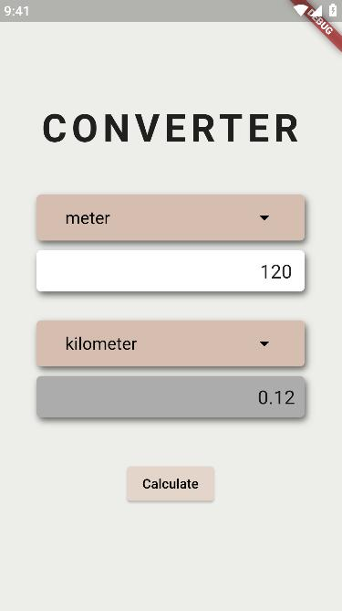

# Length Converter

A flutter program that let its user to convert length to other length unit.

Units that included are:

- milimeter
- centimeter
- meter
- kilometer

**v1 branch**

branch that contain the first version code of the application. Beginner style of programming. Not much separation of logic.

### Author

**Leo Anthony Cortez**
